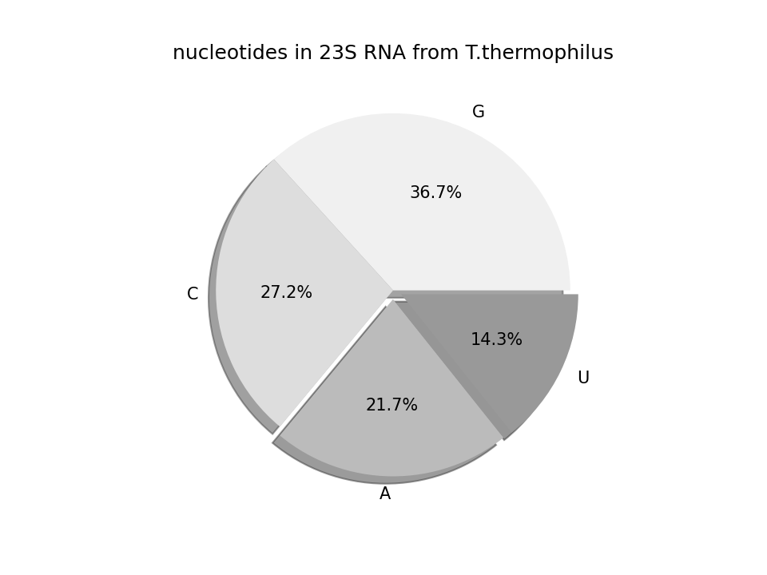

How to plot a bar chart?
------------------------

.. figure:: barplot.png

`matplotlib` is capable of producing static images of all common types of diagrams in print quality: line plots, scatter plots, bar charts, pie charts, histograms, heat maps etc.
The library is somewhat oldschool – it was written to produce diagrams for printed documents.
For more interactive graphics for the web, consider **altair**, **bokeh** or **plotly**.

Install `matplotlib` with:

.. code::

    pip install matplotlib

The following code produces a bar chart:

.. literalinclude:: barplot.py

How to draw a scatterplot?
--------------------------

.. figure:: scatterplot.png

.. literalinclude:: balls.py

How to draw a line plot?
------------------------

.. figure:: lineplot.png

.. literalinclude:: lineplot.py

How to draw error bars?
-----------------------

.. figure:: errorbars.png

.. literalinclude:: errorbars.py

How to draw a pie chart?
------------------------

.. literalinclude:: piechart.py

.. seealso::

   A good way to learn what you can do is to browse the examples gallery on `matplotlib.org <http://matplotlib.org/>`__.

   You find a comprehensive tutorial in the `Scipy Lectures <https://scipy-lectures.org/intro/matplotlib/index.html>`__.
