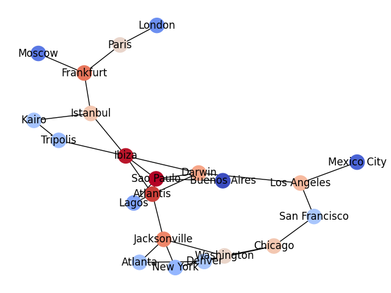

How to plot a graph?
--------------------

The `NetworkX` library processes and plots graphs.

Install it with:

.. code::

    pip install networkx

The example below uses the [PageRank algorithm](https://en.wikipedia.org/wiki/PageRank) to calculate the centrality (relative importance) of nodes in the graph.
The nodes are colored according to their page rank score (more red=more central).

The code uses the data in :download:`city_pairs.csv`:

.. literalinclude:: page_rank.py
