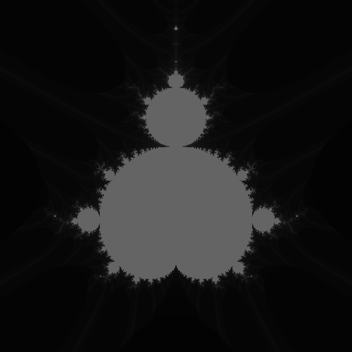

How to draw a fractal image with NumPy?
=======================================

The Numpy library makes it easy to work with matrices in Python.

Because it is implemented in C, `numpy` accelerates many calculations. It is also type-safe - all elements of a matrix have the same type. Many of the most powerful Python libraries like `pandas`, `scikit-learn` and `PILLOW` have been built on top of numpy.

Install it with:

.. code::

    pip install numpy

The following code draws the the Mandelbrot set:

.. literalinclude:: mandelbrot.py

.. seealso::

   - `Numpy Graphics Tutorial <https://www.academis.eu/numpy_graphics>`__
   - `www.numpy.org/ <http://www.numpy.org/>`__
