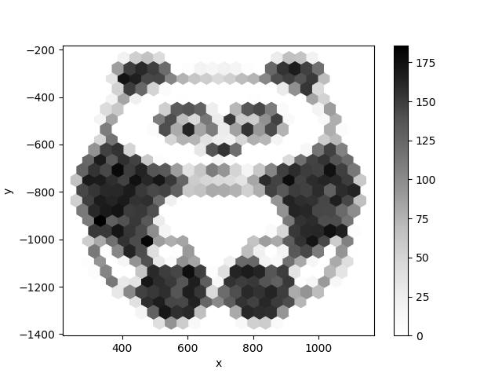

How to section a panda into hexagons with pandas?
=================================================

`pandas` is an extremely powerful library to analyze, combine and manipulate data in many ways.
It provides a class for tables called *DataFrames* that are inspired from R. DataFrames have an index column and functions for plotting and reading from CSV or Excel files are included by default. Pandas uses `numpy` under the hood.

Install it with:

.. code::

    pip install pandas

The following code creates some eye candy:

.. literalinclude:: hexpanda.py

.. seealso::

   - `pandas.pydata.org/ <http://pandas.pydata.org/>`__
