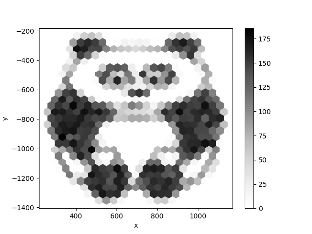

How to divide a panda image into hexagons?
==========================================

`pandas` is an extremely powerful library to analyze, combine and manipulate data in many ways.
It provides a class for tables called *DataFrames* that are inspired from R.
DataFrames have an index column and functions for plotting and reading from CSV or Excel files are included by default. Pandas uses `numpy` under the hood.

Install it with:

.. code::

    pip install pandas

The library can do a lot more than can be described here. 
See the `pandas go to space tutorial <https://www.academis.eu/pandas_go_to_space/>`__ for a deeper overview.

The following code creates some eye candy:

.. literalinclude:: hexpanda.py

.. seealso::

   - `pandas go to space tutorial <https://www.academis.eu/pandas_go_to_space/>`__
   - `pandas.pydata.org/ <http://pandas.pydata.org/>`__
