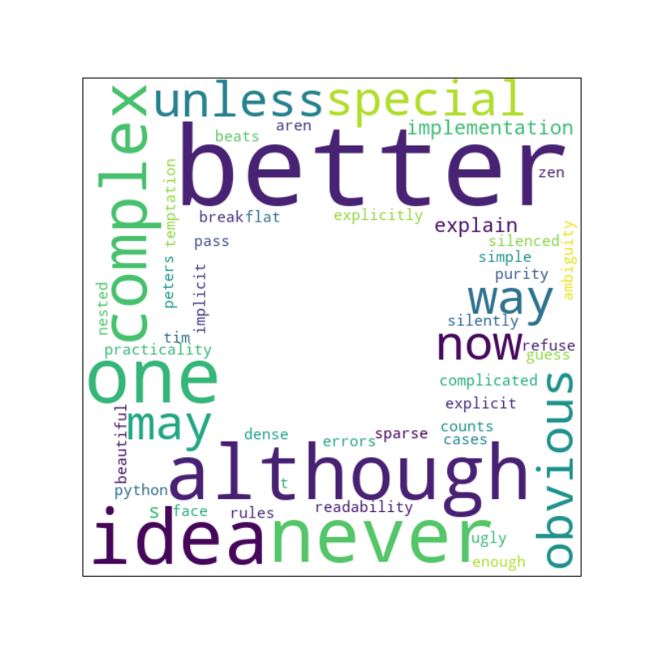

How to draw a word cloud?
=========================

The `wordcloud` library draws word clouds from a string of words.
It allows to create clouds in arbitrary shapes, using a NumPy array as a mask.

Install the library with:

.. code::

    pip install wordcloud

Then create the cloud image:

.. literalinclude:: create_wordcloud.py
